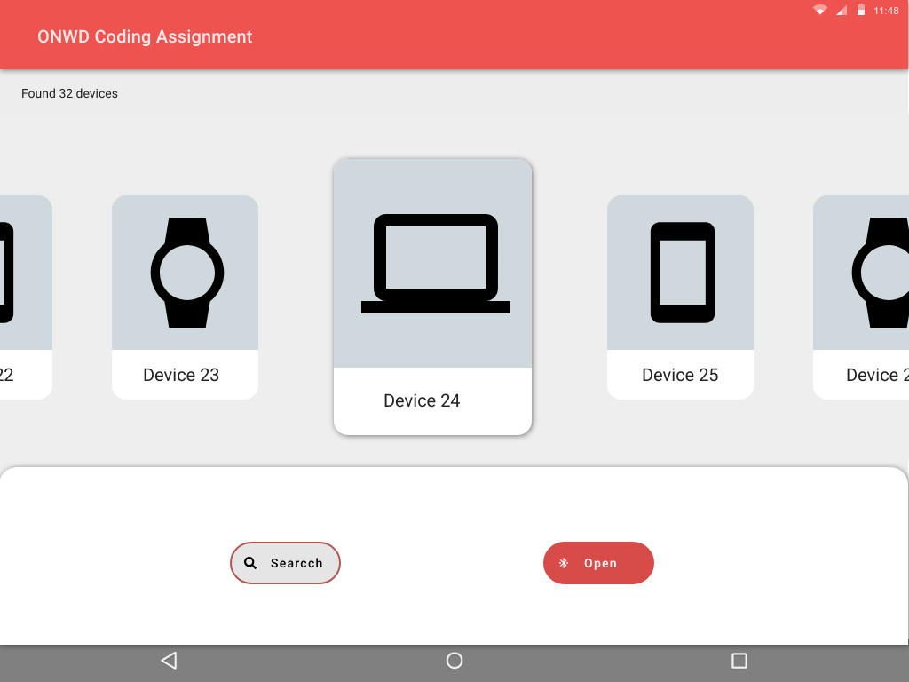
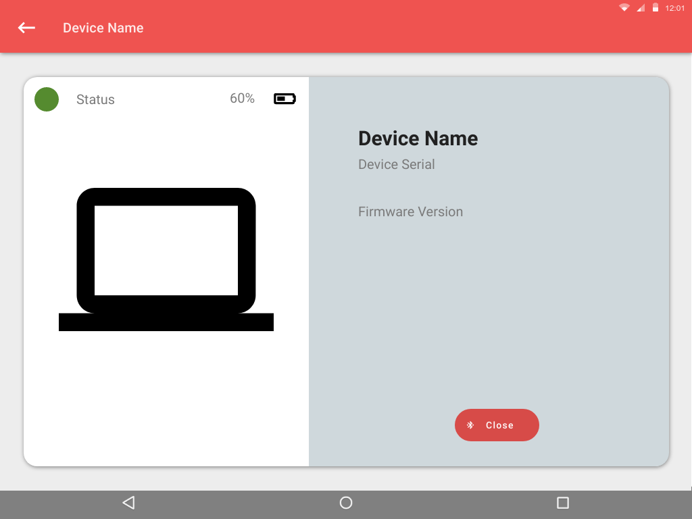

# ONWARD Coding Assignment

## Introduction
Thank you for taking the time to take on this assignment. In this assignment, you will find a base implementation of an Android App and some feature requests we would like you to implement.

### Feature requests
1. Search, pressing the search button starts a search
2. List results, show the results of the search
3. Open, selecting a device and pressing open navigates to the 'Device Details' view
4. Device Details, the 'Device Details' view should show the details of the previously selected device
5. Navigate back, navigating back to the first view, and the first view should show the search results and previously made selection

### Requirements
- Try to make the screens look as close as possible to the provided mock-ups
- Prove that the App is working correctly
- Refactoring is stimulated, make sure however that the functionality doesn't change
- When adding new code, please use Kotlin
- When modifying existing Java code, please keep it in Java

### Optional
If you have RxJava knowledge and would like to show it off, refactor parts where you think using RxJava would improve the code.

## Mock-ups
Below are the designs for both screens on a 9" Tablet.
Use the available clip arts/ icons from Android Studio when needed. 

### Search

### Device Details

